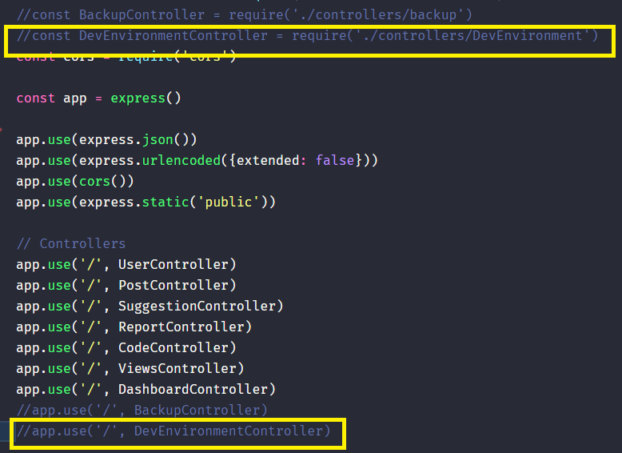

<div align="center">
  
  
  
  
  
  
</div>

<div align="center">


</div>

## API Valorant tips

### Description

Api of the project Valorant tips.

### Preparing the development environment

If your goal is to be on the front-end, just worry about that topic.

1.   Install the [mongodb community server](https://www.mongodb.com/try/download/community?tck=docs_server)
2.   Start mongodb
> On windows, open the Command Prompt as administrator, run the command "net start mongodb", this should start mongodb. Then run the command "mongo" to access the database, if you can access it, you can continue the steps. On Linux the process is similar, but I won't document it here.
3.   With everything working, fork the project
4.   Clone the fork on your machine
5.   Access to development branch

```shell
git checkout -b develop origin/develop
```

6.   Install the necessary packages

```shell
npm install
```

7.   Copy the ".env.develop.example" file to ".env".
> Note that within the .env file, the only parameter you might need to adjust is the "MONGO_URI".
8.   Go to app.js, and uncomment the import and call in the controller of the "DevEnvironment"


9.   Run the application (consider installing nodemon, or setting package.json to node)

```shell
npm run dev
```

10.   Access the address below for the development environment to be created.

```shell
http://127.0.0.1:3333/prepare_dev_environment
```

11.   Recommend the two lines you uncommented, this is extremely important as we don't want this feature to be available in the production environment.
> Pull request with these uncommented lines will be rejected



12.   Okay, development api configured, now we will have several posts for testing and an access user

```text
username: developer
password: developer
```

### Production Environment

To deploy you need to have knowledge of NodeJs, Google Cloud Buckets, Multer, Heroku, ExpressJs, Jest, MongoDb Local and MongoDb Atlas.

You need to create a file called 'google-credentials.json' with your Google Cloud Bucket credentials. In practice, leave this file only to test the local backend with Google Buckets and in production, because, during the development environment, Google Cloud Bucket as well as mongodb Atlas are not used.

### Tests

To run the automated tests you need to have just installed globally.

```shell
npm run test
```

### Run the project

To run the application, run the command below

```shell
node src/server.js
```
